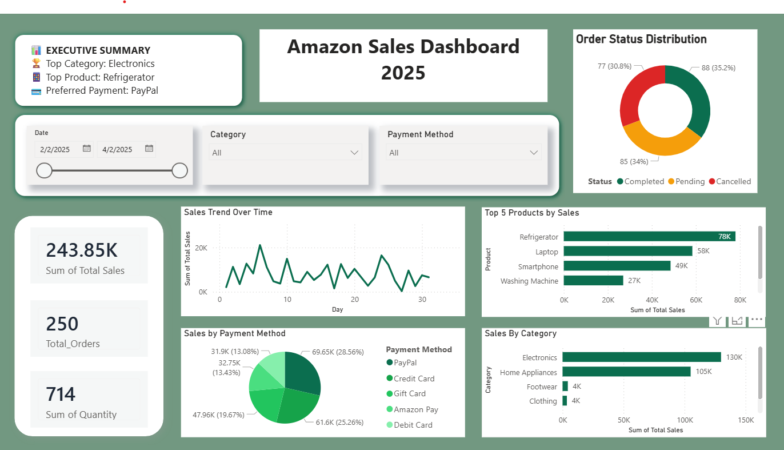
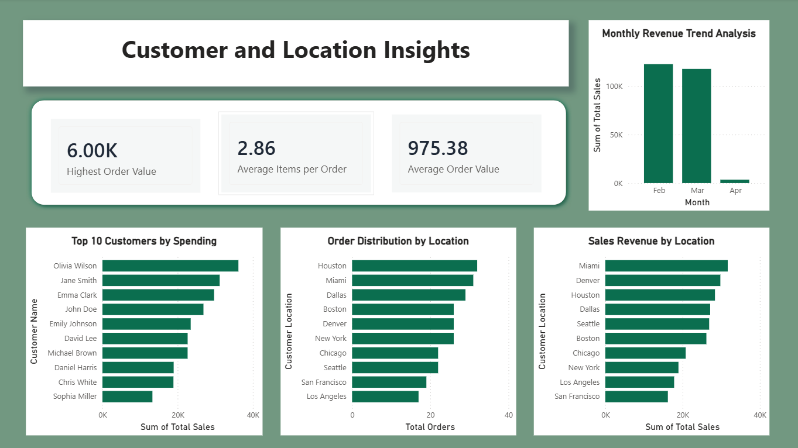

# 📊 Amazon Sales Dashboard 2025 (Power BI Project)

## 🧠 Project Overview

This Power BI project analyzes an Amazon sales dataset (CSV format) to uncover key business insights such as sales performance, customer behavior, product trends, payment methods and geographic distribution.

The goal of this dashboard is to transform raw transactional data into meaningful insights that support data-driven decision-making.

---

## 📁 Dataset Information

- File Type: CSV
- Records: ~250 rows
- Fields: Order ID, Date, Product, Category, Price, Quantity, Total Sales, Customer Name, Customer Location, Payment Method, Status

⚠️ Note: This dataset is used for learning and portfolio purposes only.

---

## 🛠️ Tools & Technologies Used

- Power BI Desktop
- Excel / CSV File
- DAX (Data Analysis Expressions)
- Data Cleaning & Transformation (Power Query)

---

## 📊 Dashboard Overview

This project contains **two main dashboard pages**:

---

## 📌 Page 1: Sales Overview Dashboard

This page provides a high-level summary of business performance.

### 🔹 Key Metrics:
- Total Sales
- Total Orders
- Total Quantity Sold
- Average Order Value

### 🔹 Visualizations:
- Sales Trend Over Time
- Sales by Category
- Top Products by Sales
- Payment Method Analysis
- Order Status Distribution

📷 **Dashboard Preview:**

---

## 📌 Page 2: Customer & Location Insights Dashboard

This page focuses on customer behavior and geographic performance.

### 🔹 Key Metrics:
- Average Order Value
- Highest Order Value
- Average Items per Order

### 🔹 Visualizations:
- Monthly Revenue Trend
- Top 10 Customers by Revenue
- Revenue by Customer Location
- Order Distribution by Location

📷 **Dashboard Preview:**

---

## 🔍 Key Insights

- Electronics category generated the highest revenue.
- PayPal was the most preferred payment method.
- Certain cities contributed significantly higher revenue.
- A small group of customers contributed a large portion of total sales.
- Sales showed variation across months, indicating seasonal trends.

---

## 📂 Files in this Repository

- AmazonSalesDashboard.pbix
- amazon_sales_data_2025.csv
- Sales_Overview.png
- Customer_and_Location_Overview.png
- README.md

---

## 📊 Business Value

This dashboard helps businesses to:

- Understand sales performance trends
- Identify top customers and products
- Analyze regional performance
- Improve decision-making based on data
- Optimize product and marketing strategies

---

## 🔗 Dataset Source

Dataset used in this project is publicly available and used for learning purposes.

Source: [https://www.kaggle.com/datasets/zahidmughal2343/amazon-sales-2025]

---

## ⚠️ Disclaimer

This project is created for educational and portfolio purposes only. It does not represent real company data.

---

## 👤 Author

Maheen Arif

Aspiring Data Analyst | Power BI Enthusiast

---

## 🚀 Future Improvements

- Add forecasting (Sales prediction)
- Drill-through analysis for products
- More advanced DAX measures
- Interactive tooltips
- Mobile-friendly dashboard view

