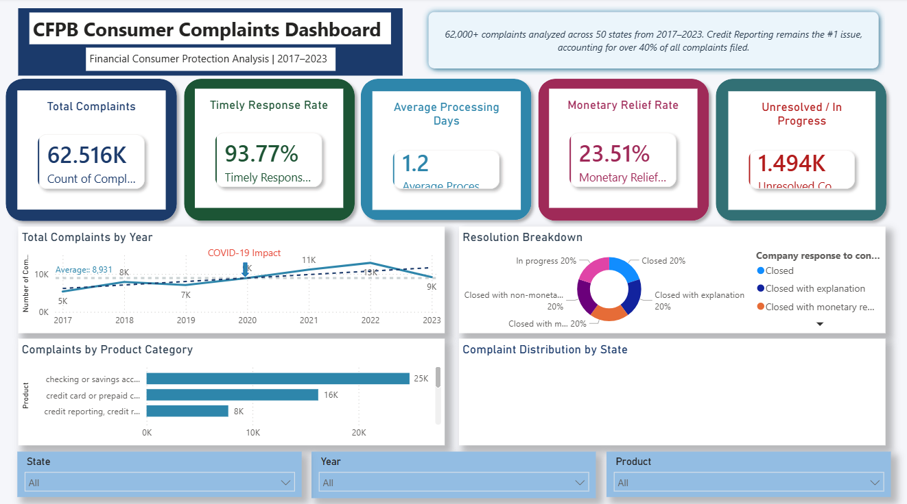
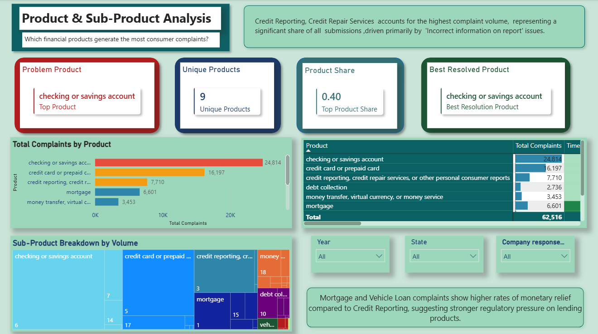
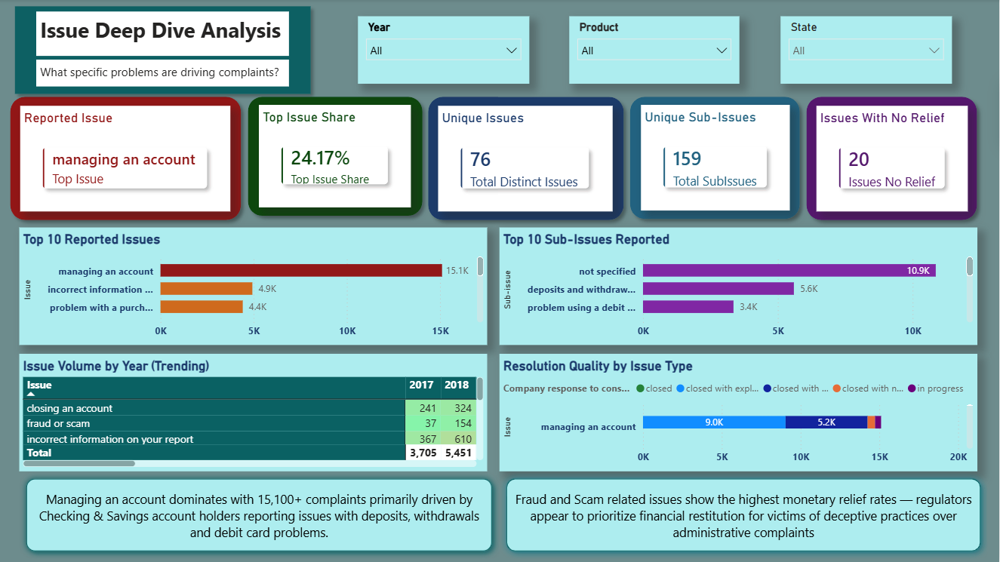
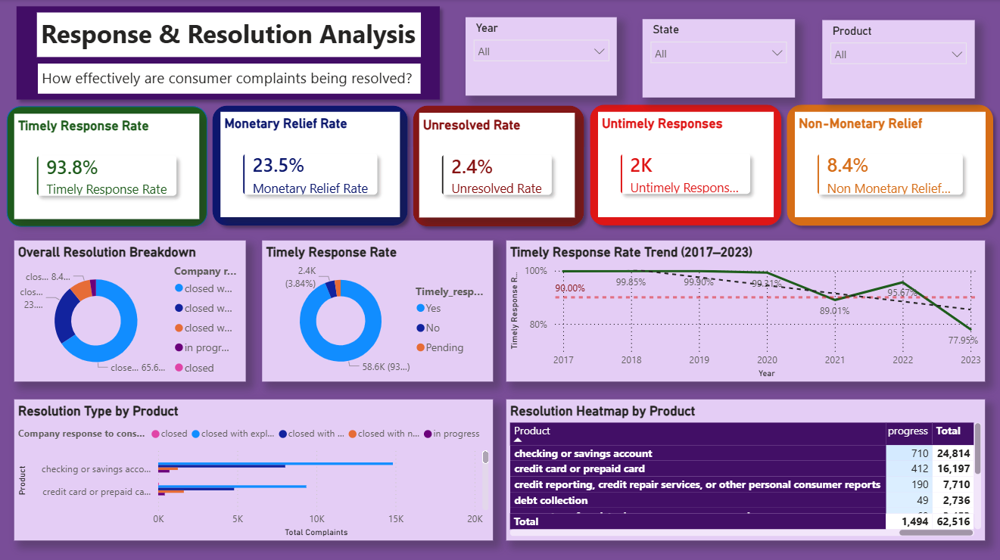
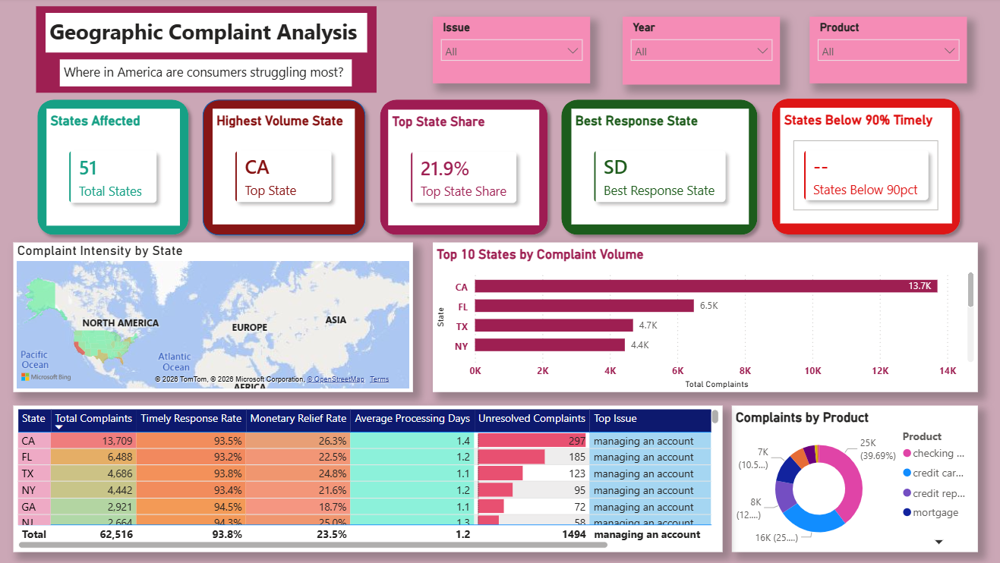
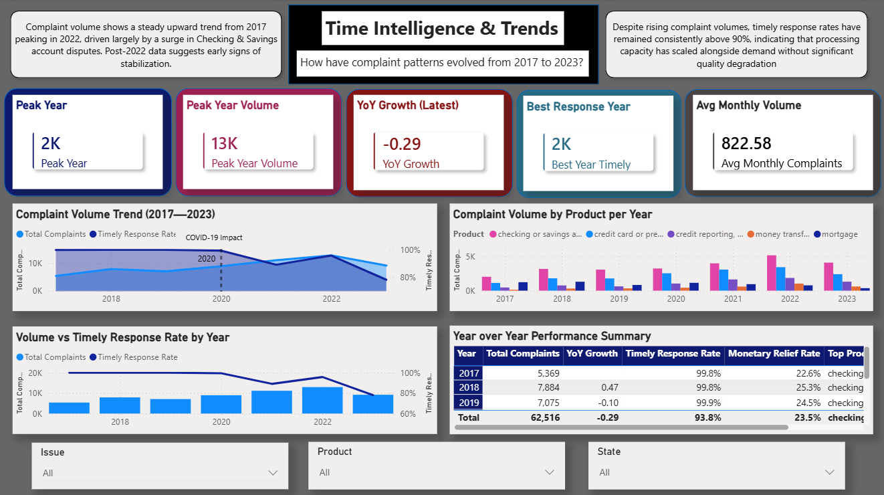

# 📊 CFPB Consumer Complaints Dashboard
### A Power BI Portfolio Project



---

## 📌 Project Overview

This project analyzes **62,516 consumer financial complaints** filed with the **Consumer Financial Protection Bureau (CFPB)** between 2017 and 2023. The goal is to uncover patterns in complaint volume, resolution quality, geographic distribution, and trends over time — presented through an interactive 6-page Power BI dashboard.

The dashboard is designed to answer key business questions:
- Which financial products generate the most consumer complaints?
- How effectively are complaints being resolved?
- Where in America are consumers struggling most?
- How have complaint patterns evolved over time?

---

## 📁 Repository Structure

```
📦 CFPB-Complaints-Dashboard
 ┣ 📊 Customer_Complaints_Report.pbix     # Power BI report file
 ┣ 📋 Consumer_Complaints.xlsx  # Raw dataset (62,516 rows)
 ┣ 🖼️ page 1.png
 ┣ 🖼️ page 2.png
 ┣ 🖼️ page 3.png
 ┣ 🖼️ page 4.png
 ┣ 🖼️ page 5.png
 ┣ 🖼️ page 6.png
 ┗ 📄 README.md
```

---

## 🗂️ Dataset

**Source:** [Maven Analytics Data Playground](https://mavenanalytics.io/data-playground/financial-consumer-complaints)

**Dataset:** CFPB Financial Consumer Complaints

| Field | Description |
|-------|-------------|
| Complaint ID | Unique identifier for each complaint |
| Submitted via | Channel used (Web, Referral, etc.) |
| Date submitted | Date consumer submitted the complaint |
| Date received | Date CFPB received the complaint |
| State | US state where complaint originated |
| Product | Financial product category |
| Sub-product | Specific sub-category of product |
| Issue | Primary complaint issue |
| Sub-issue | Specific sub-category of issue |
| Company public response | Company's public statement |
| Company response to consumer | Resolution type provided |
| Timely response | Whether response was timely (Yes/No) |

**Dataset Size:** 62,516 rows × 12 columns  
**Time Period:** 2017 — 2023  
**Geographic Coverage:** 51 states/territories (including DC)

---

## 🛠️ Tools & Technologies

| Tool | Purpose |
|------|---------|
| Microsoft Power BI Desktop | Data modeling, DAX, visualization |
| Power Query Editor | Data transformation & dimension creation |
| Microsoft Excel | Raw data source |
| DAX (Data Analysis Expressions) | Custom measures & calculations |

---

## ⚙️ Data Transformation (Power Query Editor)

Significant data preparation was performed in Power Query Editor before building the data model. Here is a summary of all steps taken:

### 1. Data Cleaning
- Removed duplicate rows based on Complaint ID
- Handled null/blank values in Sub-issue and Sub-product columns (replaced with "Not Specified")
- Standardized text casing across all categorical columns (converted to lowercase for consistency)
- Trimmed leading/trailing whitespace from all text fields
- Validated date columns — ensured Date submitted ≤ Date received

### 2. Star Schema Design
The original flat Excel file was transformed into a **star schema** with 1 fact table and 6 dimension tables.

#### Fact Table — `Fact_Complaints`
Contains all transactional complaint records with foreign keys linking to dimension tables:

| Column | Type | Description |
|--------|------|-------------|
| Complaint ID | Integer | Primary identifier |
| Date submitted | Date | Submission date |
| Date received | Date | Receipt date |
| ProductKey | Integer | FK → Dim_Product |
| SubProductKey | Integer | FK → Dim_Subproduct |
| IssueKey | Integer | FK → Dim_Issues |
| SubIssueKey | Integer | FK → Dim_Subissues |
| StateKey | Integer | FK → Dim_Geography |
| ResponseKey | Integer | FK → Dim_Response |
| Timely_response | Text | Yes/No |
| Company response to consumer | Text | Resolution type |

#### Dimension Tables Created

**Dim_Product**
- Referenced Fact_Complaints → selected Product column only
- Removed duplicates → added Index column starting at 1 → renamed to ProductKey

**Dim_Subproduct**
- Same process on Sub-product column
- Produces ~30 unique sub-product categories

**Dim_Issues**
- Based on Issue column
- ~76 unique issue types identified

**Dim_Subissues**
- Based on Sub-issue column
- ~159 unique sub-issue values

**Dim_Geography**
- Based on State column
- 51 unique state/territory values
- Data category set to "State or Province" for map visuals

**Dim_Response**

Created by combining the following response-related fields:

- Company public response
- Company response to consumer
- Timely response

This dimension centralizes all complaint resolution and communication attributes, enabling analysis of company communication practices, resolution outcomes, and response timeliness from a single lookup table.

The table supports dashboard analysis related to:

- Resolution type distribution
- Timely vs. untimely responses
- Public response trends
- Product-level resolution performance
- Consumer outcome analysis

### 3. Date Dimension
Created a dedicated `Dim_Date` table using DAX CALENDAR function:

```dax
Dim_Date = 
VAR MinDate = MIN(Fact_Complaints[Date received])
VAR MaxDate = MAX(Fact_Complaints[Date received])
RETURN
ADDCOLUMNS(
    CALENDAR(MinDate, MaxDate),
    "Year", YEAR([Date]),
    "Month Number", MONTH([Date]),
    "Month Name", FORMAT([Date], "MMMM"),
    "Quarter", "Q" & QUARTER([Date]),
    "Year-Month", FORMAT([Date], "YYYY-MM"),
    "Weekday", FORMAT([Date], "DDDD")
)
```

---

## 📐 Data Model

The final model follows a **Star Schema** architecture:

```
                    Dim_Date
                        │
        Dim_Issues      │      Dim_Response
             │          │           │
Dim_Product──┼──── Fact_Complaints ─┤
             │          │           │
    Dim_Subproduct      │      Dim_Subissues
                        │
                   Dim_Geography
```

All dimension tables connect to `Fact_Complaints` via **one-to-many relationships** (1 side on dimension, * side on fact).

> 📷 **See model view screenshot in the repository for the full relationship diagram.**

---

## 📏 DAX Measures

All measures are stored in a dedicated `_Measures` table for organization:

### Core KPIs
```dax
Total Complaints = COUNTROWS(Fact_Complaints)

Timely Response Rate = 
DIVIDE(
    CALCULATE(COUNTROWS(Fact_Complaints),
        Fact_Complaints[Timely_response] = "Yes"),
    [Total Complaints], 0
)

Monetary Relief Rate = 
DIVIDE(
    CALCULATE(COUNTROWS(Fact_Complaints),
        Fact_Complaints[Company response to consumer] 
        = "closed with monetary relief"),
    [Total Complaints], 0
)

Unresolved Complaints = 
CALCULATE(COUNTROWS(Fact_Complaints),
    Fact_Complaints[Company response to consumer] = "in progress")

Avg Processing Days = 
AVERAGE(DATEDIFF(
    Fact_Complaints[Date submitted],
    Fact_Complaints[Date received], DAY))
```

### Advanced Measures
```dax
YoY Growth = 
VAR CurrentYear = CALCULATE([Total Complaints],
    Dim_Date[Year] = MAX(Dim_Date[Year]))
VAR PreviousYear = CALCULATE([Total Complaints],
    Dim_Date[Year] = MAX(Dim_Date[Year]) - 1)
RETURN DIVIDE(CurrentYear - PreviousYear, PreviousYear)

Resolution Score = 
VAR TimelyWeight   = [Timely Response Rate] * 0.4
VAR ReliefWeight   = [Monetary Relief Rate] * 0.4
VAR UnresolvedPenalty = [Unresolved Rate] * 0.2
RETURN (TimelyWeight + ReliefWeight - UnresolvedPenalty) * 100

vs National Average = 
VAR StateComplaints = [Total Complaints]
VAR NationalAvg = 
    AVERAGEX(ALL(Dim_Geography[State]),
        CALCULATE([Total Complaints]))
RETURN DIVIDE(StateComplaints - NationalAvg, NationalAvg)
```

---

## 📊 Dashboard Pages

### Page 1 — Executive Summary


High-level overview with KPI cards, complaint trend line, resolution breakdown donut chart, top products bar chart, and USA filled map.

**Key KPIs:** Total Complaints · Timely Response Rate · Avg Processing Days · Monetary Relief Rate · Unresolved Complaints

---

### Page 2 — Product & Sub-Product Analysis


Deep dive into which financial products generate the most complaints, with a performance scorecard using conditional formatting.

**Key Insight:** Checking & Savings accounts lead with 24,814 complaints (39.7% of total), while Credit Reporting has the lowest monetary relief rate at 3.5%.

---

### Page 3 — Issue Deep Dive


Explores the specific issues consumers raise, with a year-trending matrix and resolution quality breakdown by issue type.

**Key Insight:** "Managing an account" is the #1 reported issue with 15,100+ complaints, primarily from Checking & Savings account holders.

---

### Page 4 — Response & Resolution Analysis


Analyzes how effectively complaints are resolved, including timely response trends and resolution type distribution by product.

**Key Insight:** 93.8% of complaints receive timely responses, but only 23.5% result in monetary relief — most consumers receive explanations rather than financial compensation.

---

### Page 5 — Geographic Analysis


State-level complaint distribution with choropleth map, top states ranking, and a full state performance scorecard.

**Key Insight:** California leads with 13,700+ complaints (21.9% of total), followed by Florida and Texas — collectively representing over 35% of all complaints nationally.

---

### Page 6 — Time Intelligence & Trends


Time-series analysis including complaint volume trends, YoY growth, monthly seasonality patterns, and product growth over time.

**Key Insight:** Complaint volume shows a steady upward trend peaking in 2022, with timely response rates remaining consistently above 90% throughout — indicating processing capacity scaled with demand.

---

## 🔍 Key Findings

1. **Checking & Savings accounts** are the most complained-about product at 24,814 cases (39.7% of total)
2. **California, Florida, and Texas** account for over 35% of all complaints nationally
3. **93.8% timely response rate** maintained consistently across all years
4. **Only 23.5%** of complaints result in monetary relief — most closed with explanation only
5. **Mortgage complaints** have the highest timely response rate at 99.1%
6. **Credit Reporting** has the lowest monetary relief rate at just 3.5%
7. **1,494 complaints** remain unresolved (In Progress) as of the latest data
8. **Managing an account** is the single largest issue category with 15,100+ complaints

---

## 🚀 How to Use This Dashboard

1. Download the `.pbix` file
2. Open in **Power BI Desktop** (free download from Microsoft)
3. Use the **slicers** (Year, Product, State) on each page to filter data
4. Hover over map regions for detailed tooltips

---

## 📋 Requirements

- Power BI Desktop (latest version recommended)
- Windows OS (Power BI Desktop is Windows only)
- Minimum 4GB RAM for smooth performance with 62K+ rows

---

## 👤 Author

**[Maheen Arif]**  

---

## 📄 License

This project is for portfolio and educational purposes.  
Dataset sourced from [Maven Analytics Data Playground](https://mavenanalytics.io/data-playground/financial-consumer-complaints) — please refer to their terms of use for data licensing.

---

## 🙏 Acknowledgements

- **Maven Analytics** for providing the dataset via their [Data Playground](https://mavenanalytics.io/data-playground/financial-consumer-complaints)
- **Consumer Financial Protection Bureau (CFPB)** as the original data collector
- **Microsoft Power BI** community for DAX resources and documentation

